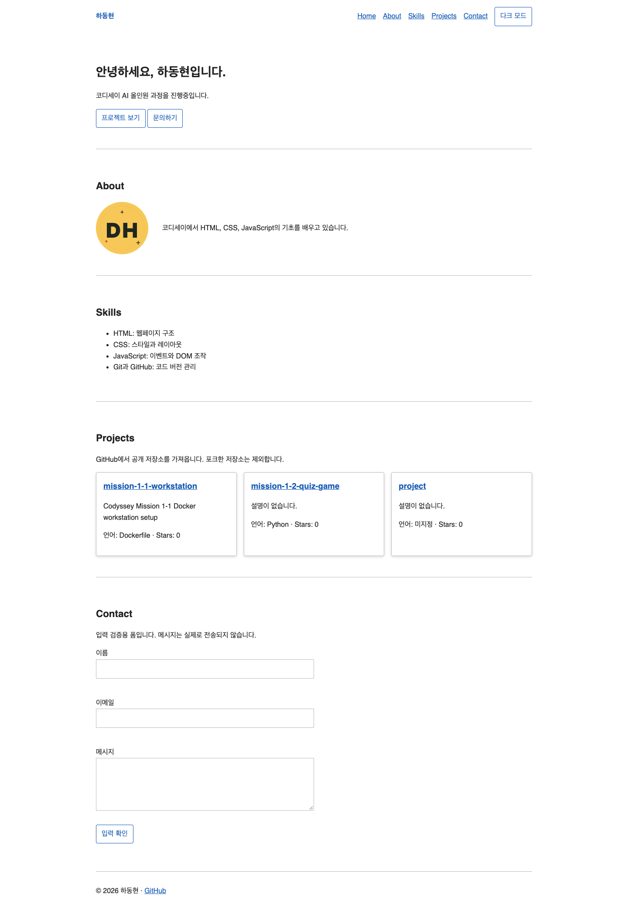
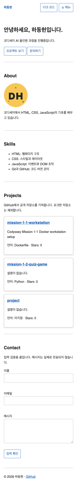
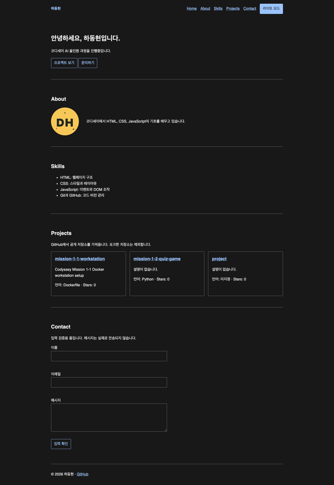

# 하동현 자기소개 · Codyssey B1-1

HTML, CSS, JavaScript의 구조와 동작을 공부하기 위한 기본 웹페이지다. 필수 요구사항과 평가문항에 필요한 기능을 포함하고, 보너스는 제외했다. 외부 라이브러리를 사용하지 않는다.

## 실행

VS Code에서 이 폴더를 열고 `index.html` 우클릭 → **Open with Live Server**를 선택한다. Live Server 설치 및 포트 5500 설정은 준비되어 있다.

- 로컬 주소: `http://127.0.0.1:5500`
- GitHub API 계정: `ehdgus6697-debug`
- 저장소 URL: [ehdgus6697-debug/mission-b1-1-portfolio](https://github.com/ehdgus6697-debug/mission-b1-1-portfolio) · 공개
- GitHub Pages URL: [자기소개 웹페이지](https://ehdgus6697-debug.github.io/mission-b1-1-portfolio/)

### 이벤트 → 상태 변경 → 화면 업데이트: 세 가지

- **테마:** 버튼 click → `STATE.theme` 변경 → `renderTheme()`이 data-theme와 버튼 글자를 변경 → CSS 변수 적용. localStorage에 저장해 새로고침 후 복원한다.
- **API:** `loadProjects()` → status를 loading으로 변경하고 렌더링 → await fetch → 응답 검사 → JSON 데이터 읽기 → success/empty 또는 catch의 error → `renderProjects()`가 화면 변경. HTTP 403 등은 fetch가 자동으로 예외를 던지지 않으므로 response.ok를 확인하고 직접 throw한다.
- **폼:** input → `validateField()` → `STATE.form.errors` 변경 → `renderForm()`이 필드 아래 오류를 표시. submit에서는 preventDefault로 페이지 이동을 막고 전체 검사 후 success와 성공 안내를 갱신한다.

`escapeHTML()`은 API의 설명 등이 HTML 태그로 실행되지 않고 글자로 표시되도록 변환한다. innerHTML로 외부 데이터를 넣으므로 필요한 처리다.

## 기능 확인

- 화면 축소: 모바일 메뉴 숨김/햄버거 표시, 768px부터 가로 메뉴
- 햄버거 클릭: active 클래스 토글로 열기/닫기
- 링크 클릭: CSS smooth scroll로 이동, 모바일 메뉴 닫기
- 스크롤: **60px**부터 헤더 배경 변경, **300px**부터 맨 위 버튼 표시
- 애니메이션: Intersection Observer **threshold 0.2**, 제목이 보이면 표시
- 버튼·카드: hover, transition, 프로젝트 카드 box-shadow
- API: 로딩/성공/오류/빈 상태, 오류 재시도, 403/429 요청 제한 안내
- 폼: 이름·이메일·메시지 필수, 공백 검사, 이메일 형식 검사, 입력 즉시 피드백, 성공 안내

API는 `/users/ehdgus6697-debug/repos?sort=updated&per_page=100`에서 최근 업데이트 순으로 최대 100개를 읽고 포크를 제외한다. 언어별 필터 UI·타이핑·실제 메일 전송·시스템 테마 감지는 구현하지 않았다. 메시지는 실제로 전송되지 않는다.

## 배포와 제출

GitHub Settings → Pages에서 **main / (root)** 로 배포한다. main 브랜치에 변경 사항을 올리면 사이트도 다시 배포된다. 다른 컴퓨터에서도 위 GitHub Pages URL로 접속할 수 있으며, 로컬 서버를 켜 둘 필요가 없다. 제출물은 저장소 URL, 배포 URL, 아래 스크린샷 3종이다. 인증 없는 API 요청은 과제 안내 기준 시간당 60회 제한이 있어 반복 새로고침을 피한다.

## 스크린샷

로컬 실행 화면이다. [검증 기록](docs/verification.md).

